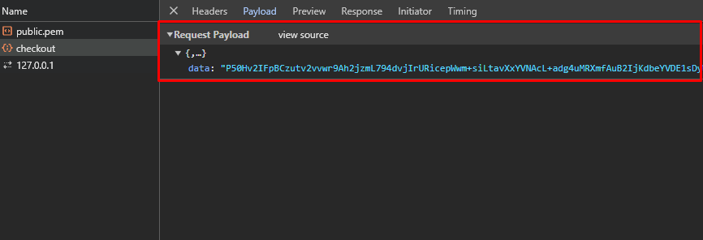
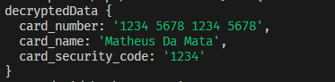

# Encrypted Checkout

Este projeto é uma demonstração de laboratório que utiliza [Next.js](https://nextjs.org/) com [TypeScript](https://www.typescriptlang.org/) para simular um processo de checkout. Ele envia dados fictícios de um cartão de crédito de forma criptografada usando criptografia assimétrica. O router handler do próprio Next.js é responsável por realizar a descriptografia dos dados utilizando a chave privada.

## Tecnologias Utilizadas

- [Next.js](https://nextjs.org/)
- [TypeScript](https://www.typescriptlang.org/)
- Criptografia Assimétrica

## Funcionalidades

- **Criptografia de Dados do Cartão**: Os dados do cartão de crédito são criptografados no lado do cliente antes de serem enviados ao servidor.
- **Descriptografia no Servidor**: O servidor utiliza a chave privada para descriptografar os dados recebidos.
- **Simulação de Checkout**: O projeto simula um processo de checkout, enviando dados criptografados para o back-end.

## Observações sobre Segurança

Este projeto implementa uma forma básica de criptografia para fins de demonstração. Embora utilize criptografia assimétrica para proteger os dados do cartão de crédito durante a transmissão, é importante notar que a segurança de uma aplicação envolve diversas outras considerações. Questões como a gestão segura de chaves, proteção contra ataques de intermediários (Man-in-the-Middle, MitM), e a implementação de medidas de segurança adicionais são essenciais para garantir a proteção completa dos dados.

## Imagens

- **Formulário fictício**

- **Dados criptografados com chave pública**

- **Dados descriptografados com chave privada**

